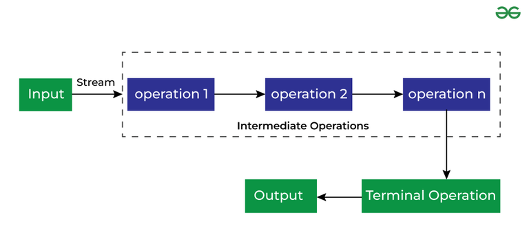

# Streams

export const Highlight = ({ children, color, url }) => (
  <span
    style={{
      backgroundColor: color,
      borderRadius: '20px',
      marginLeft: '20px',
      color: '#fff',
      padding: '10px',
      cursor: 'pointer',
    }}
    onClick={() => {
      window.open(url, '_blank').focus();
    }}
  >
    {children}
  </span>
);

## Les streams - C'est quoi ?

Un stream est une séquence d'élements qui nous permet de faire des opérations sur les collections en utilisant la programmation fonctionnel.



:::tip Remarque

Les streams ne stockent pas de données, ils traitent les données.

:::

## Les avantages des streams

1. **Bonne lisibilité du code** : ou on décris exactement ce qu'on veut en utilisant la programmation fonctionnel (succession de fonction appelé l'une après l'autre).
2. **Parallelism** : On peut utiliser le parallelism en utilisant les streams, juste en appelant la fonction parallel()
3. **Fonctionnalités prédéfinies** : Les streams fournisse des fonctionnalités prédéfinies comme filter, foreach, map, flatmap...
4. **Laziness** : Les streams sont lazy, donc le code n'est appelé seulement quand cela est nécessaire <i>(terminal operation)</i>.

## La différence entre les collections et les streams

|                   | Collections          | Streams                                                                                                                |
| ----------------- | -------------------- | ---------------------------------------------------------------------------------------------------------------------- |
| Cas d'utilisation | Stockage de données. | Traitement de données.                                                                                                 |
| Processing        | Eager Processing.    | Lazy Processing (n'exécutent aucune des opérations intermédiaires tant qu'une opération terminale n'est pas invoquée). |
| Modifiabilité     | Mutable.             | Immutable.                                                                                                             |
| Itération         | boucle for, while... | Des fonctionnalités fournies par le Stream API. (filter, map...).                                                      |

## Comment créer des streams

- ### Depuis une Liste ou Set :

```cpp
// List
List<String> list = Arrays.asList("d", "e", "v", "o");
Stream<String> listStream = list.stream();

// Set
Set<Integer> set = new HashSet<>(Arrays.asList(1, 2, 3));
Stream<Integer> setStream = set.stream();
```

- ### Depuis un Array :

```cpp
String[] array = {"d", "e", "v", "o"};
Stream<String> arrayStream = Arrays.stream(array);
```

- ### en utilisant builder() :

```cpp
Stream<String> stream = Stream.<String>builder()
    .add("d")
    .add("e")
    .add("v")
    .add("o")
    .build();
```

- ### en utilisant Stream.generate() :

```cpp
Stream<String> generatedStream = Stream.generate(() -> "devoteam").limit(3);
// résultat : ["devoteam", "devoteam", "devoteam"]
```

- ### en utilisant Stream.iterate() :

```cpp
Stream<Integer> iteratedStream = Stream.iterate(0, n -> n + 1).limit(5);
// résultat : [0, 1, 2, 3, 4]
```

## Les opérations intérmediaires des streams

- ### filter() :

- ### map() et flatMap() :

- ### sorted() :

- ### peek() :

- ### distinct() :

- ### limit() et skip() :

- ### mapping et flatMapping au types primitifs :
