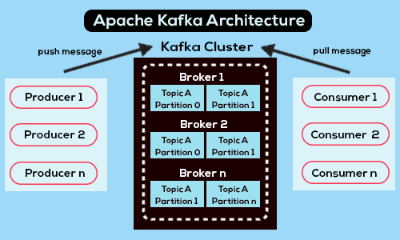

# Kafka

## C'est quoi Kafka ? (réponse courte)

Kafka est une plateforme de streaming d'événements distribuée open source.

## Pourquoi avons-nous besoin de Kafka ?

- **Traitement des données en temps réel** : Kafka permet le traitement en temps réel de grandes quantités de données, agissant comme un système de messagerie hautement évolutif et tolérant aux pannes.
- **Découplage** : Kafka facilite le découplage entre les consommateurs et les producteurs. Les producteurs peuvent envoyer des données aux topics sans se soucier de la manière dont elles seront traitées, et les consommateurs peuvent s'abonner aux topics sans se préoccuper de la manière dont ces données sont envoyées.
- **Scalabilité** : Kafka permet de faire évoluer horizontalement les consommateurs ou les producteurs pour gérer des volumes de données croissants, sans se soucier de la cohérence des données.

## Architecture de Kafka ?

**Producteur** : Entité qui publie des données vers le broker. Les producteurs envoient des messages aux topics spécifiés, sans se soucier de la manière dont ces messages seront consommés.

**Consommateur** : Entité qui consomme des données depuis le broker. Les consommateurs s'abonnent à un ou plusieurs topics et lisent les messages produits par les producteurs.

**Broker** : Serveur intermédiaire qui reçoit les messages des producteurs et les stocke pour qu'ils soient consommés par les consommateurs. Les brokers gèrent la persistance des messages et garantissent la fiabilité de leur livraison.

**Cluster** : Ensemble de brokers Kafka répartis sur plusieurs régions ou centres de données pour assurer la tolérance aux pannes et l'évolutivité. Les clusters permettent une distribution et une réplication des données pour garantir une haute disponibilité.

**Topic** : Catégorie ou flux de messages. Les topics permettent de structurer les messages en fonction de leur type ou de leur sujet. Un broker peut gérer plusieurs topics, chacun ayant des configurations spécifiques.

**Partitions** : Division d'un topic en plusieurs segments plus petits. Les partitions permettent le parallélisme dans le traitement des messages et améliorent la tolérance aux pannes. Chaque partition peut être répliquée sur plusieurs brokers pour assurer la continuité du service en cas de panne.

**Offset** : Numéro de séquence unique attribué à chaque message dans une partition. Les offsets permettent de suivre les messages et de gérer la progression de la consommation par les consommateurs. Chaque consommateur garde trace de l'offset du dernier message qu'il a traité.

**Groupe de Consommateurs** : Ensemble de consommateurs qui travaillent ensemble pour lire des données depuis un ou plusieurs topics de manière parallèle et coordonnée. Chaque consommateur d'un groupe se voit attribuer une ou plusieurs partitions, garantissant qu'un message donné n'est consommé qu'une seule fois par le groupe.

**Zookeeper** : Service de coordination distribué utilisé par Kafka pour gérer les informations sur le cluster, les configurations et les métadonnées des topics. Zookeeper assure la synchronisation entre les brokers et surveille l'état des composants du cluster pour garantir une gestion fiable et cohérente.
